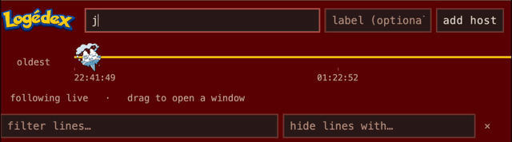
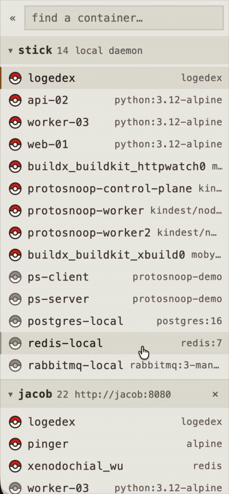
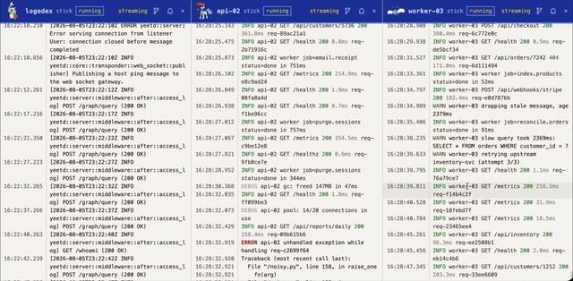
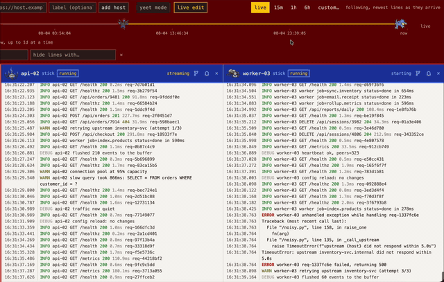
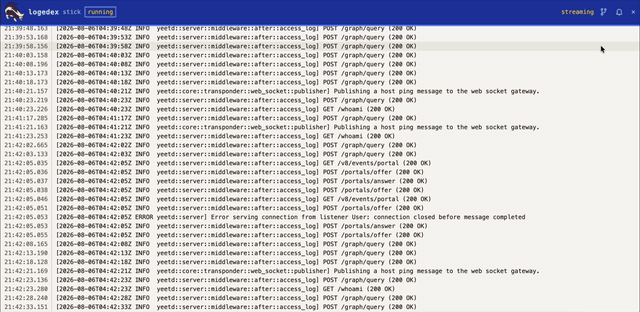
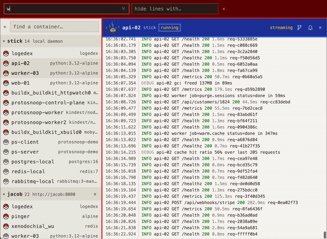
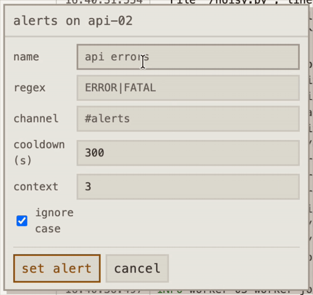

<!-- yeet:user-friendly-title: Query distributed logs -->

# Logédex

> **Container logs from every host you run, side by side in one browser tab.** Enter a host's URL, get its containers, attach the ones you care about (from any host), and read the streams next to each other.

<p align="center">
  
  
  
  
  <a href="https://discord.gg/JxVseaAVAU"></a>
</p>

<p align="center">
  
</p>

**Logédex puts `docker logs` from your whole fleet in one tab.** Attach any container on
any box; each pane is a live subscription. One time range moves every pane at once, so
lining up 04:08:54–04:08:59 across six containers on four hosts is a drag of one slider.
Combine several streams into a single pane and read them interleaved by timestamp, so the
same service on three boxes reads as one story.

Built on the [yeet](https://yeet.cx/docs/?utm_source=github&utm_medium=readme&utm_campaign=logedex) **system graph**, which already models the Docker
API: no agent protocol, no log shipper, no index, no eBPF.

> [!TIP]
> **Every instance is both halves.** The box you point a browser at fans out to the
> others by calling the exact endpoints it answers for itself. Nothing registers and
> nothing is discovered. You type a URL.

## Have an agent set it up

Paste this into a coding agent on the box you want logs from. It clones the repo,
brings the dashboard up with something logging into it, and tells you whether it worked.

```text
Clone https://github.com/yeet-src/logedex and get it running on this machine,
then tell me whether it actually works.

Read AGENTS.md before you run anything; it has the boot order and the traps.
Run `make demo` before `make up` — an empty dashboard looks identical to a
broken one, so there needs to be something writing log lines first.

Verify with `curl localhost:8080/api/containers` and tell me whether web-01,
api-02 and worker-03 are listed. "The container is up" is not the same as
"it works".

If this machine is Docker Desktop or OrbStack, run `make up NET=` instead of
`make up`: host networking isn't real there, so the port needs publishing.
```

Prefer to drive it yourself? [Manual install](#manual-install) is two commands.

## Manual install

For one host you have a shell on. Nothing to configure.

```sh
git clone https://github.com/yeet-src/logedex.git && cd logedex
make demo                            # three containers that log like real services
make up                              # build + run detached  → http://localhost:8080
```

Open `http://localhost:8080` and attach a demo container from the sidebar.

Run `make demo` before you judge the thing. An empty grid and a broken grid look
identical, so give it something writing lines first. `make demo-stop` clears those
containers out.

`make up` covers what would otherwise be flags. It builds the image, creates the state
directory owned by you instead of root, passes this machine's `hostname -s` in as the
box's label (inside a container `hostname` is the container id, which names the wrong
thing), and reaches for `sudo docker` if you're not in the `docker` group. Rename the box
later with `make up LOCAL_LABEL=web-01`.

### One `docker run`, no clone

The published image is multi-arch (`linux/amd64`, `linux/arm64`), so this skips the clone
and the build entirely:

```sh
docker run -d --name logedex --restart unless-stopped \
  --network host \
  -v /var/run/docker.sock:/var/run/docker.sock \
  -v "$HOME/.local/state/logedex:/data" \
  -e LOCAL_LABEL="$(hostname -s)" \
  -e STATE_UID="$(id -u)" -e STATE_GID="$(id -g)" \
  ghcr.io/yeet-src/logedex:latest
```

A few notes on that command:

- **`/data`** is where the host list and alert rules are persisted. Mount something there
  or they go away with the container.
- **`STATE_UID`/`STATE_GID`** are what keep this to one command. The server runs as root
  inside the container, so a mount directory it creates lands root-owned and you can't
  touch `hosts.json`; passing your ids has it chown them instead. (Creating the directory
  yourself first does the same thing.)
- **`--network host` and `LOCAL_LABEL`** are what make a multi-host list work. Both are
  explained under [Running a fleet](#running-a-fleet); on one box you can leave them alone.
- **Live editing is off** in this form. See [Live editing](#live-editing) to turn it on.
- **Built it yourself?** Swap the last line for `logedex`. `make push` is what publishes
  the multi-arch tag.

**The Docker socket is the only grant it needs** — no `--privileged`, no BPF
capabilities, no host PID namespace. That socket is also the whole security story: the
Docker API has no read-only mode, so grant it as you'd grant docker access, and don't
put the port on the public internet without something in front of it.

Other targets: `make down`, `make logs`, `make dev` (run from a checkout with
`node --watch`, no container), `make demo` / `make demo-stop`.

## Running a fleet

One instance per box. Run the manual install on **every host you want logs from**, then pick
one as the box you point a browser at. That instance fans out to the others by calling the
same endpoints it answers for itself, so there's nothing extra to install on the ones it
reaches.

Add the others in the top bar (`box-two.lan:8080`, `https://logs.example.com`, …), or
declare them up front:

```sh
make up HOSTS="box-two.lan:8080 box-three.lan:8080" LOCAL_LABEL=web-01
```

None of this is handled for you:

- **Reachability is yours.** No discovery, no registration, no tunnel. You type a URL and
  that box has to answer on it from where the viewing instance sits.
- **Names resolve because of `--network host`.** The default shares the host's network
  namespace, so the container reads the host's own `resolv.conf` and loopback resolvers
  (systemd-resolved, Tailscale MagicDNS) still answer. On a bridge they won't: add hosts by
  IP, or pass `make up NET= DNS=100.100.100.100`.
- **`LOCAL_LABEL` is what a row is called.** Set it per box and the sidebar reads `web-01`
  instead of a hostname you have to decode. `make up` defaults it to the machine's
  hostname.

Only the viewing box needs to be signed in to yeet; see [Login](#login). Hosts in one list
don't have to agree on a yeetd version, since each answers for itself.

Walking a stack of boxes through the same two commands is the part to hand to an agent.

## Live editing

You can edit anything about this tool. The colors and sprites, the merge ordering, the
filter syntax, what the sidebar shows. Also the parts you can't see: `agent/logstream.js`
holds the Docker subscription open inside the yeet daemon, so "restyle the panes" and
"change what gets collected in the first place" are the same size of job. The container
serves its own source out of a bind mount and reads it back per save, so none of it needs a
rebuild, a restart, or a `docker exec`.

It's built for handing to an AI agent, and the dashboard writes the prompt for you.

### Click **live edit** in the dashboard

The panel names the directory on *your* host and hands you a briefing to paste
into your coding agent: the layout, which saves restart the server and which just need a
reload, where a crash gets written, and which three runtimes can fail independently. Copy,
paste, describe what you want changed.

The prompt is generated from this deployment's real paths: the path
depends on what you mounted, and a plausible wrong path sends an agent off editing a
directory nobody is serving.

**No button?** Then the source isn't mounted, and no prompt will fix that. See below.

### Turning it on

| how you started it | live editing |
| --- | --- |
| `make up`, `make edit` | **on**, the mount is automatic |
| `make edit` | on, and prints the host path on startup |
| `docker run` as shown [above](#one-docker-run-no-clone) | **off**, no `/edit` mount |
| `docker run` with the two flags below | on |

`make up` runs a container just like `docker run` does; it just passes the mount for you. If
you took the one-command route, add these and start it again:

```sh
-v "$HOME/.local/state/logedex/src:/edit" \
-e EDIT_SRC_HOST="$HOME/.local/state/logedex/src"
```

Both matter. The first is the mount, the second is only so the dashboard can tell your
agent the host path. With the mount but not the variable you still get a working panel, and
a briefing with a blank where the path should be.

Then `docker rm -f logedex`, run it again, and the button is there.

### The two reload rules

| you saved | what happens |
| --- | --- |
| `server/**`, `shared/**`, `agent/**` | the server restarts itself in about a second; open panes reconnect on their own |
| `server/public/**` | nothing restarts; the dashboard offers a reload in the corner |

If an edit doesn't parse, the server stays down until it's fixed, and the traceback is in
`.logedex/server.log` inside the source directory. It recovers on its own once you save
something that works.

The `Dockerfile`, entrypoint and `Makefile` are deliberately **not** in the mount. They
decide how the container is built and launched, so changing them means editing a checkout
and rebuilding.

### Keeping or discarding your edits

Edits survive container restarts and image upgrades. The mount is the source of truth once
seeded, and startup warns you when the image has drifted from it without overwriting
anything. To throw them away:

```sh
make up EDIT_RESET=1        # discard the edits, re-seed from the image
```

[`AGENTS.md`](AGENTS.md) carries what reading the source won't tell you: boot order, the
test command, and the isolate's missing globals (no `fetch`, no `fs`, no `Intl`) that make
`agent/` unlike everything around it. [`CLAUDE.md`](CLAUDE.md) points at the same file, so
either name works. Point your agent at it, or at the panel's briefing, which covers the
same ground for the running deployment.

<!--  -->

> **What you're granting.** That directory is code this container executes, and the
> container holds the Docker socket, so anything that can write to it has root on the box.
> Nothing is writable over HTTP (there is deliberately no endpoint that changes a file),
> and `/app` inside the image is never touched. If you don't want it, don't mount `/edit`:
> the app still runs, with the source reachable only via `docker exec`.

## Features

<!-- Feature clips live in assets/<name>.gif. See AGENTS.md for the capture checklist.
     Uncomment the remaining  tags as their clips land. -->

### A host list you type into

A LAN name or a public URL, kept in a JSON file across restarts. Each box is asked what
it calls itself, so a row reads `web-02` rather than `box-two.lan:8080`. Reachability is
your problem: no discovery, no tunnel, no registration.



### Containers per host, running or stopped

Hosts collapse to a line with a count, one box narrows every host at once (type,
`↑`/`↓`, `Enter` to attach), and the sidebar folds to a rail (`«`, or ctrl+B) when the
logs want the width.



### Log panes, side by side

Each is a live subscription. stderr reads brighter than stdout, ANSI colour from the
container is preserved, timestamps are docker's, and a stopped container replays what it
wrote then says `ended`. Drag the seam between panes to resize (arrow keys work too);
double-click to even them out.



### Scroll back for more

A pane loads the newest 2000 lines of its window and fetches the stretch before them
when you scroll to the top, so a six-hour range doesn't have to choose which two
thousand of it you get. Pages are time slices sized from the density already on screen,
because docker has no "newest N before this moment" to ask for.

<!--  -->

### One time range across every pane

`live`, a lookback (`15m`/`1h`/`6h`), or a custom window. Every open pane jumps
together. This is the feature the whole layout exists for: lining up one five-second
window across six containers is a single drag rather than six.



### Combined panes

The merge glyph in a pane's header pulls other hosts' logs into it, ordered by timestamp
and colour-coded per stream. It suggests the same service elsewhere in the fleet, so the
usual case is one click, and hitting it again adds a third host to the two already there.

If two hosts' clocks disagree by more than two seconds, the pane says so
(`⚠ clocks differ ~Ns`) rather than ordering lines confidently and wrongly. Interleaving
by timestamp is only as good as the clocks behind it, and silently getting that wrong is
worse than not offering the feature.



### Two filter boxes

One keeps the lines that match, one hides the lines that do, so `/health` flooding a pane
is one word away from gone. Terms are space-separated and AND-ed, `"quoted phrases"`
work, `-health` excludes, matching is case-insensitive, and both boxes apply to every
pane as you type, with nothing re-fetched. A multi-line entry like a traceback is filtered
as one thing.

**No regex, by design.** A pattern typed in a browser would be compiled and run inside
the yeet isolate, once per log line, on a production host. A catastrophically
backtracking pattern there doesn't just fail slowly, it can wedge the daemon for every
script on that box. Substring terms cost the same on every input, so the worst a query
can do is match nothing.



### Alerts to Slack

The bell in a pane's header takes a regex and a Slack channel. The rule runs whether or
not a tab is open, sends the lines around the match, and is rate limited (five minutes by
default). Slack has to be paired with your yeet account first at
[yeet.cx/settings](https://yeet.cx/settings?utm_source=github&utm_medium=readme&utm_campaign=logedex).

Alerts *do* take a regex where filters don't, because a rule is saved once by hand rather
than typed per keystroke. Before a pattern is ever stored it's run in a **worker thread**
against inputs built to trigger the common backtracking shapes, and terminated if it
doesn't come back inside the budget. You cannot time a regex on the thread you care about
(there's no step limit and no interrupt in JS regex), so the canary runs somewhere
killable. Costs about 30ms per save.



### Two themes

The top-bar button switches between **yeet mode** (dark, the default) and **pokédex mode**
(light, with creature icons). Remembered per browser. The sprites that ship are
placeholders, so drop your own into `server/public/sprites/` and reload.

<!--  -->

## Login

The dashboard is gated on **this box being signed in to yeet** — the same door the rest
of the tooling uses, so there's no second credential. Open it on a box that isn't signed
in and it offers a **sign in with yeet** button that drives the ordinary device flow.
For a deployment, skip the click:

```sh
make up YEET_AUTH_KEY=...
```

Only the box you point a browser at needs to be signed in; the ones it fans out to can
stay signed out. The gate covers the UI and nothing else. `/api/*` stays open, because
the yeet daemon underneath answers without any of this. **If the logs themselves need
protecting, that's a network boundary**: a tailnet, a VPN, or a reverse proxy with real
auth.

## Environment

| var           | default              | meaning                                                             |
| ------------- | -------------------- | ------------------------------------------------------------------- |
| `PORT`        | `8080`               | port the dashboard and the agent API are served on                  |
| `HOSTS`       | —                    | space/comma-separated host URLs to add at startup                   |
| `LOCAL_LABEL` | this machine's hostname | what to call this box in the UI                                  |
| `HOSTS_FILE`  | `/data/hosts.json`   | where the host list is persisted (`""` disables persistence)        |
| `ALERTS_FILE` | `/data/alerts.json`  | where alert rules are persisted (`""` disables persistence)         |
| `TAIL`        | `500`                | log lines buffered per container, to backfill a new viewer          |
| `MAX_WINDOW`  | `86400`              | widest history one request may replay, in seconds (`0` = no cap)    |
| `MAX_LINES`   | `2000`               | most lines one request may replay — the newest that many in its window |
| `REQUIRE_LOGIN` | `1`                | dashboard asks for a yeet login; `0` turns the gate off              |
| `YEET_AUTH_KEY` | —                  | register the host non-interactively, so the gate is already satisfied |
| `EDIT_DIR`    | `/edit`              | where the app runs from *inside* the container                       |
| `EDIT_SRC`    | `$STATE/src`         | `make` only: where that directory is on the **host**                 |
| `EDIT_SRC_HOST` | —                  | the host path, purely so the UI can name it                          |
| `EDIT_RESET`  | `0`                  | `1` discards what's in there and re-seeds from the image on start    |
| `DNS`         | —                    | `make up` only: a resolver for the container                         |
| `NET`         | `host`               | `make up` only: `host` shares the host's netns; `NET=` uses a bridge |
| `YEET_BIN`    | `yeet`               | path to the `yeet` binary                                           |
| `AGENT_DIR`   | `../agent`           | where `logstream.js`, `alert.js` and `caps.js` live                 |
| `POSTHOG_KEY` | a Logédex project key | product analytics for the dashboard; `""` turns it off entirely |
| `POSTHOG_HOST` | `https://ph.yeet.cx` | the PostHog proxy the browser loads from and reports to             |
| `POSTHOG_DEBUG` | `0`                | `1` logs every event to the browser console                         |

## Requirements

Linux, Docker, and yeetd on each host (the image installs its own). The graph's
`docker_logs` subscription needs yeetd **v0.19 or newer**; on v0.20+ a freshly attached
pane also backfills history from docker itself. Hosts in one list don't have to agree on
a version, since each answers for itself.

macOS and Windows work through Docker Desktop or OrbStack. Docker runs in a Linux VM
there, but the socket you mount is the same daemon your `docker ps` talks to, so the
containers listed are the ones you actually run. One flag changes: host networking isn't
real on those platforms, so bring it up with `make up NET=`, which puts the container on
a bridge and publishes the port.

## FAQs

**Do I need a log shipper, an agent, or an index?**
No. Each box runs one container that reads its own Docker socket through the yeet system
graph. Nothing is ingested, nothing is stored centrally, and there's no pipeline to fall
behind. The trade is that no index means no search over history: a pane holds the last
2000 lines of the window you picked, not everything your driver kept.

**Does this need privileged access or eBPF?**
No. The Docker socket and a port, that's the whole grant. No `--privileged`, no BPF
capabilities, no host PID namespace, no BTF mount. Note that the socket is itself
root-equivalent on the host, so "unprivileged container" is not the same as "harmless".

**Why can't I find a line I know exists?**
Usually the time range, or you haven't scrolled back to it yet. A pane loads the newest
2000 lines of the window you selected — and asks for only those, so a wide window on a
busy container isn't replayed in full — then fetches the stretch before them when you
scroll to the top. The filters run over the lines currently loaded rather than over your
whole log, so scroll back to the period you mean, or narrow the range and the same query
reaches further in one go.

**Is it safe to put this on the internet?**
Not as-is. The login gate covers the UI only, `/api/*` answers without it, and the
container holds a root-equivalent socket. Put it on a tailnet or behind a reverse proxy
with real auth. The port being reachable is the thing to control.

**How is this different from Loki, ELK, or `docker logs` in six terminals?**
Loki and ELK index; they answer "how many errors last Tuesday" and Logédex cannot. Six
terminals show you the same streams but leave you to line up timestamps by eye, which is
the part that actually costs time. Logédex sits in the middle: no pipeline to run, one
time range across every pane, and streams from different hosts interleaved into one
reading order.

## How it works

Every instance plays two roles, which is why it stays small:

```
browser ──► HUB role                     AGENT role ──► yeetd ──► docker
            /api/containers  ─┬─ local ──────┘         (system graph)
            /api/logs         │
                              └─ remote ──► http://box-two:8080/api/local/…
                                                 (same endpoints, other box)
```

The **agent role** answers for one box: `/api/local/containers` is a
`docker { list_containers }` graph query, and `/api/local/logs` is an SSE stream fed by a
`docker_logs` subscription running in the yeet daemon's isolate (`agent/logstream.js`).
The **hub role** calls those endpoints (in-process for the local host, over HTTP for
everyone else) and serves the UI. A remote host isn't a different kind of thing to talk
to, so there's one protocol, not two.

```
agent/logstream.js       the isolate: docker_logs subscription → JSON lines

shared/search.js         query parsing + matching — used by all three runtimes
shared/limits.js         the window cap — browser offers it, server enforces it
shared/alertrule.js      the shape and limits of an alert rule

server/index.js          HTTP routes for both roles
server/graph.js          one-shot graph reads (the container list)
server/isolate.js        run an agent isolate, parse its JSON lines
server/logs.js           local log streams: fan-out, tail buffer, lifecycle
server/hosts.js          the host list, persisted
server/remote.js         calling another host's agent API (list + SSE relay)
server/auth.js           the yeet login gate
server/alerts.js         alert rules: watches, matching, delivery
server/redos.js          the worker-thread canary that vets an alert's regex

server/public/           the dashboard (plain DOM, no framework, no CDN)
server/public/order.js   line ordering, merge defaults, stream labels
server/public/entries.js grouping lines back into multi-line entries
server/public/ansi.js    escape sequences → text plus styled runs
server/public/edit.js    the live-edit panel, and the agent briefing it prints
```

Run the tests with `cd server && npm test`. Node's built-in runner, nothing to install.

### HTTP surface

| route | what it does |
| ----- | ------------ |
| `GET /` | the dashboard |
| `GET /api/containers` | every host's containers, in one response |
| `GET /api/logs?host=…&container=…[&since=…][&until=…][&find=…]` | SSE, routed to that host |
| `GET /api/oldest?host=…&container=…` | oldest reachable line, for the scrubber's left edge |
| `GET /api/hosts` · `POST` · `DELETE ?id=…` | the host list |
| `GET /api/alerts[?caps=recheck]` | alert rules, plus whether Slack is connected |
| `POST /api/alerts` · `DELETE ?id=…` | create or replace a rule · delete one |
| `POST /api/alerts?test=<id>` | deliver that rule's alert now, ignoring its cooldown |
| `GET /api/local/containers` | this host's containers (the agent role) |
| `GET /api/local/logs?container=…[&since=…][&until=…][&find=…]` | this host's log stream (the agent role) |
| `GET /api/local/oldest?container=…` | when this host's history for it starts (the agent role) |
| `GET /api/edit` | whether live-edit mode is on, and where the source is (read-only) |
| `GET /api/sprites` · `GET /sprites/<name>.<ext>` | creature icons for the pokédex theme |
| `GET /healthz` | liveness, host count, attached streams |

## License

GPL-2.0

---

Built with [yeet](https://yeet.cx/docs/?utm_source=github&utm_medium=readme&utm_campaign=logedex), a JS runtime for writing eBPF programs on Linux machines. Join us on [discord](https://discord.gg/JxVseaAVAU?utm_source=github&utm_medium=readme&utm_campaign=logedex).
